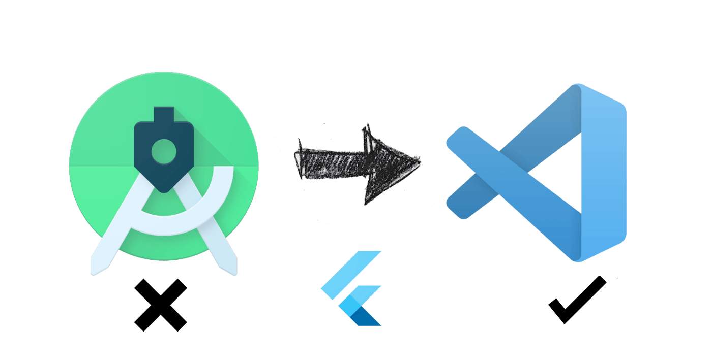
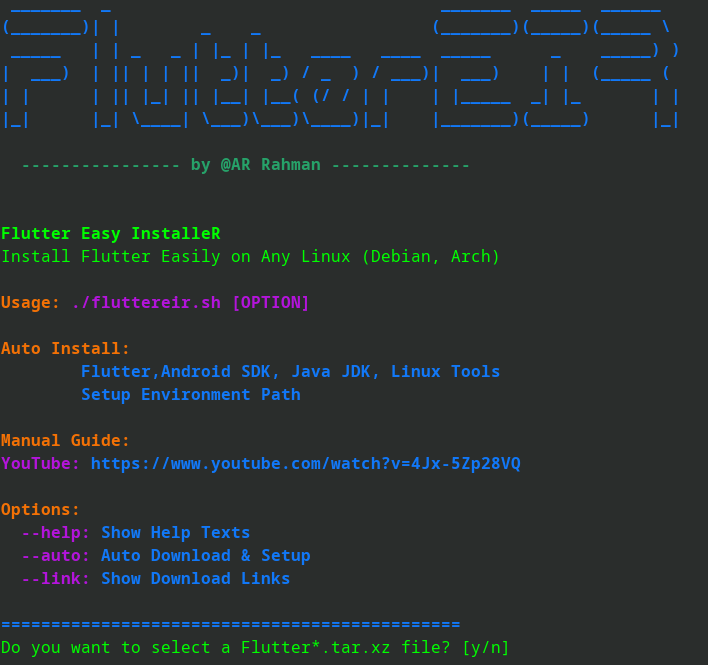

Fluttereir
==========

Fluttereir is a convenient bash script that automates the installation process of Flutter on any Linux systems. With just one click, you can have Flutter up and running on your machine, ready for developing cross-platform applications.
Tested on Arch, Ubuntu, Debian.

Prerequisites
-------------

Before using this script, ensure that you have the following prerequisites installed on your system:

*   Linux operating system (tested on Arch, Ubuntu, Debian, and Kali)

Installation
------------

To use Fluttereir, follow these steps:

1.  Clone this repository to your local machine:
    
    `git clone https://github.com/arrahmanbd/fluttereir`
    
2.  Navigate to the project directory:
    
    `cd fluttereir`
    
3.  Make the script executable:
    
    `chmod +x fluttereir.sh`
    
4.  Run the script:
    
    `./fluttereir.sh`
    
    The script will automatically download and install the latest version of Flutter on your system.
    

Usage [OPTIONS]
-----

Once this repo cloned is complete, you can start using Fluttereir right away. Here are some useful commands to get started:

*   **Show Help:**
    
    To show help screen
    
    `fluttereir.sh --help`
    
*   **Get Download Links:**
    
    To get the download link
    
    `fluttereir.sh --link`
    
*   **Auto Download:**
    
    To start auto download.
    
    `fluttereir.sh --auto`
    
    This will launch auto setup.But not recommended.
    

How To Use
------------
*   **Download Required Files:**
    
    `fluttereir.sh --link`
    
    This command will show the links for required files. Simply download them using your favorite browser.

*   **Start Setup:**

    Now run this command, It will start setup. Simply follow on screen instruction.
    
    `./fluttereir.sh`
    
   

Isn't it simple!! If you can improve this script then please contribute. For more information on how to use Fluttereir, refer to the my [LinkedIn](https://linkedin.com/in/arrahmanbd).

Demo
-----------

Contributing
------------

Contributions to this project are welcome. If you encounter any issues or have suggestions for improvements, please feel free to open an issue or submit a pull request.

License
-------

This project is licensed under the [MIT License](LICENSE).